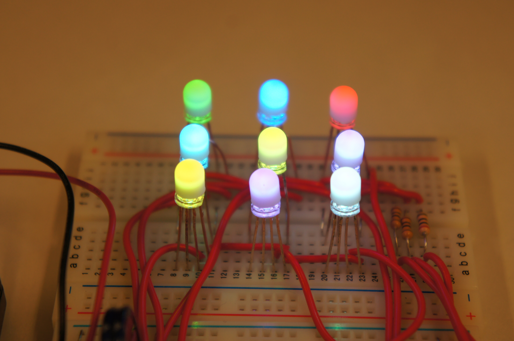
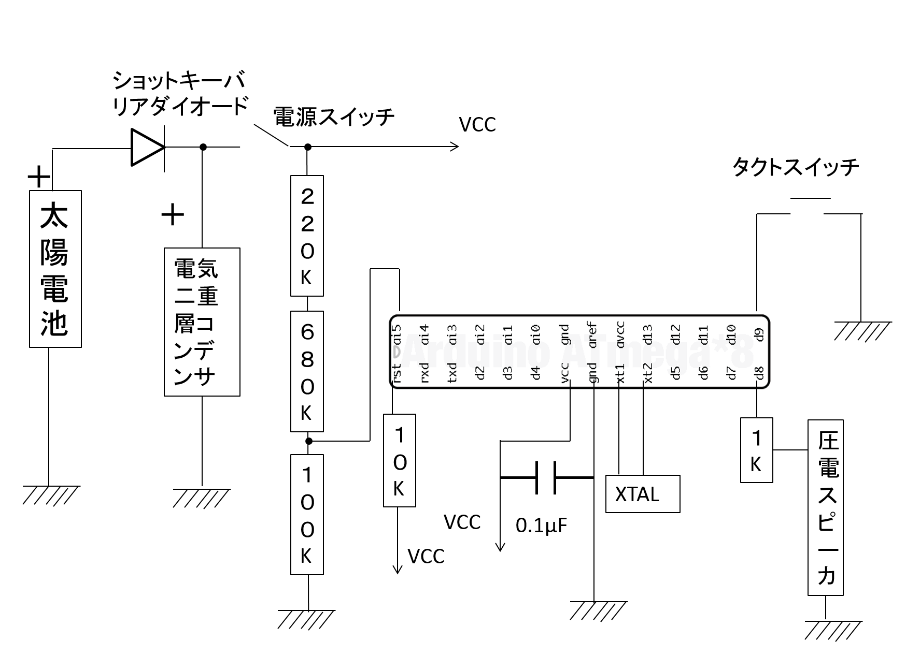
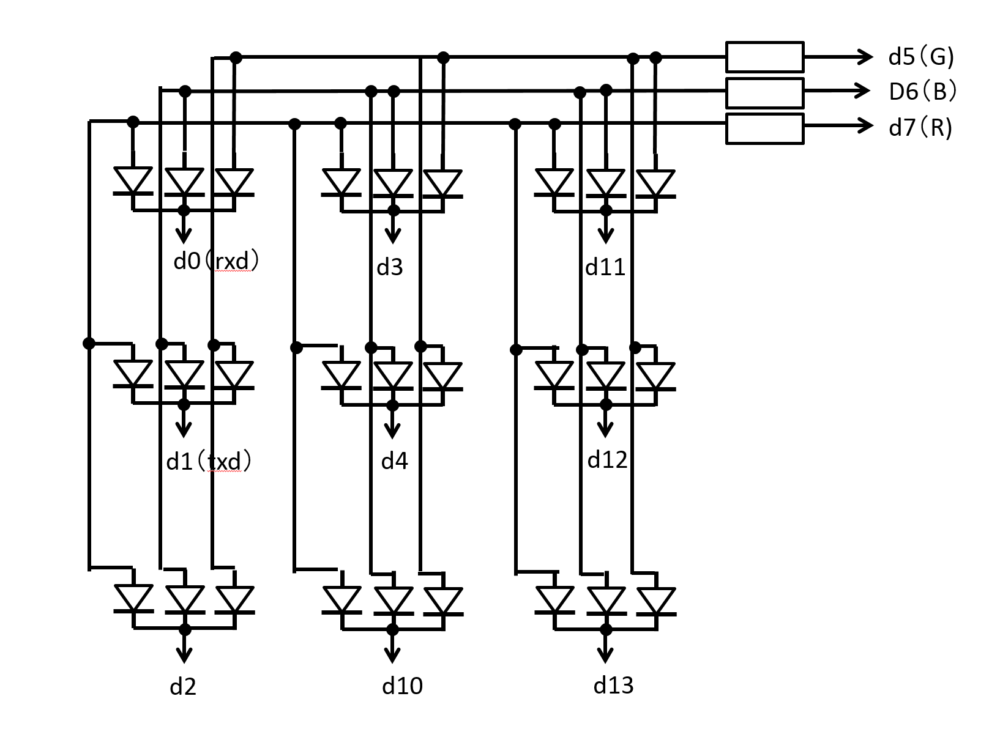

RGB matrix
==========

八頭ものづくり教室(第三回)スケッチ




曲リスト
-------

|曲|曲名|スケッチ内名称|
|:---|:---|:----------|
|曲1|四季の歌  |shikinouta|
|曲2|ハウルのメインテーマ  |haurunomaintame|
|曲3|たきび  |takibi|
|曲4|Wake up  |wakeup|
|曲5|RPG(sekai no owari)  |rpg|
|曲6|おぼろ月夜  |oboroduki|
|曲7|ニンジャりバンバン  |ninjaribanban|
|曲8|くつがなる  |kutsuganaru|
|曲9|みかんの花咲く丘  |mikannnohanasakuoka|
|曲10|千本桜(配信用)  |senbonzakura|
|曲11|箱根八里  |hakonehachiri|
|曲12|ジングルベル  |bell|
|曲13|We Wish You a Merry Christma  |merrychristmas|
|曲14|Let It Go(アナと雪の女王) |letitgo|

パターンリスト
-------

|パターン|光り方|スケッチ内名称|
|:---|:---|:----------|
|パターンA|音が再生されるたびに発光箇所(一箇所)と色が変化|patternFlushPoint|
|パターンB|音が再生されるたびにLEDの輪が回転|patternFlushC|
|パターンC|3音再生されるたびに発光色が変化,すべてのLEDは同じ色|patternFlushPointSlow|
|パターンD|音が再生される都度,LEDが円を描くように発光(色は順に変化)|patternFlushTurn|
|パターンE|音の高さに応じてすべてのLEDの色が変わる|patternPitch2Color|
|パターンF|音が再生されるたびに３箇所(ランダム)のLEDの色(ランダム)が変わる|patternRandom3|
|パターンG|4音再生されるたびにすべてのLEDの色(ランダム)が変わる,3音目で消灯|patternRandom3Blink|


### 曲とパターンの設定方法
```cpp
// これより上は基本的に変更の必要なし

//3つのパターンについてそれぞれ別の曲を再生させている
//タクトスイッチを押せば次のパターンに変化
void loop(){

	//曲名[merrychristmas]を設定(曲リストの「スケッチ内名称」を参照のこと)
	//melody.setMelodyの引数として
	//	merrychristmas_Melody:音程リスト
	//	merrychristmas_Duration:音長さリスト
	//	merrychristmas_Length:曲長さ
	//を設定している
    melody.setMelody( merrychristmas_Melody, merrychristmas_Duration, merrychristmas_Length);
	
	//パターン名[patternFlushPointSlow]を設定(パターンリストの「スケッチ内名称」を参照のこと)
	//playPatternの引数として
	//	patternFlushPointSlow:パターン
	//	allcolor:使用する色リスト
	//を指定すれば、そのパターンで発光開始(タクトスイッチが押されると終了)
    playPattern(patternFlushPointSlow,allcolor);


    //曲名[bell]を設定し、パターン名[patternFlushTurn]で発光開始
    melody.setMelody( bell_Melody, bell_Duration, bell_Length);
    playPattern(patternFlushTurn,allcolor);
    


    //曲名[letitgo]を設定し、パターン名[patternRandom3Blink]で発光開始
    melody.setMelody( letitgo_Melody, letitgo_Duration, letitgo_Length);
    playPattern(patternRandom3Blink,allcolor);


    //余計なことを書かない
}
```


Schematic
---------

### 全体


### LED部


Pin assign
----------
|pin name|pin mode|connect circuit|
|:-------|:-------|:--------------|
|d0      |OUT     |Anode1
|d1      |OUT     |Anode2
|d2      |OUT     |Anode3
|d3      |OUT     |Anode4
|d4      |OUT     |Anode5
|d5      |OUT     |Cathode green
|d6      |OUT     |Cathode blue
|d7      |OUT     |Cathode red
|d8      |OUT     |Buzzer
|d9      |PULLUP  |Tact switch
|d10     |OUT     |Anode6
|d11     |OUT     |Anode7
|d12     |OUT     |Anode8
|d13     |OUT     |Anode9

Files
------

|ファイル名|内容|
|:-------|:---|
|RGB_matrix.ino|スケッチのメイン|
|led_fullcolor_9.h|9個のフルカラーLEDをダイナミック点灯制御するためのライブラリ|
|digiRW.h|高速にIO処理を行うためのライブラリ|
|playMelody.h|メロディの再生のためのライブラリ|
|sounds.h|メロディを記述|
|pattern.ino|発光パターンを記述|
|README.md|このファイル|
|LICENCE|The MIT License|
|[reference]|参考プロジェクト|


How to Use Library
----------

### Led
namespaceで定義している

#### functions
```cpp
void init();    //初期化
void setInterval(int val);  //ダイナミック点灯制御の切り替え周期[ms]
void set(byte bit,LedColor color);  //{bit}番目のLEDを{color}色に設定
void setAll(LedColor color);    //すべてのLEDを{color}色に設定
void lighting();    //設定された状態に発光({interval}[ms]以内に定期的に呼び出しする必要あり)
void lighting(LedColor data[]); //{data}の定義どおりに発光({interval}[ms]以内に定期的に呼び出しする必要あり)
void lightingWhile(unsigned long wait);    //設定された状態に{wait}[ms]発光
void lightingWhile(LedColor data[],unsigned long wait); //{data}のどおりに{wait}[ms]発光
```

#### tutorial
```cpp
LedColor pattern1[9];
pattern1[0]=RED;    //[RED,GREEN,BLUE]で色を指定
pattern1[1]=GREEN;
pattern1[2]=BLUE;
pattern1[3]=CYAN;    //[CYAN,YELLOW,MAGENTA]からも選択可能
pattern1[4]=YELLOW;
pattern1[5]=MAGENTA;
pattern1[6]=WHITE;   //[WHITE]を選択可能
pattern1[7]=OFF;     //光らせない時は[OFF]
pattern1[8]=OFF;
Led::lightingWhile(pattern1,1500);  //pattern1を1500[ms]出力し続ける

Led::setAll(OFF);
Led::set(0,BLUE);    //set(led,color):指定ledを指定色に設定
Led::set(3,RED);
Led::set(5,GREEN);
Led::set(8,BLUE);
Led::lightingWhile(800);     //設定済みの色で800[ms]出力し続ける

Led::setAll(OFF);     //すべて同じ色ならsetAll()で設定可能
Led::lightingWhile(2000);     //設定済みの色で2000[ms]出力し続ける
```

### PlayMelody
classとして定義している  
曲ごとに宣言する想定

#### functions
```cpp
PlayMelody(int pin);
void setMelody(int* _melodyArr,int* _durationArr,int _length);	//メロディーの設定
int play();	//再生(戻り値[1:新しい音の出力][0:前回と同じ音を出力])
void pause();	//一時停止、再び再生するときは停止したところから
void stop();	//停止、再び再生するときははじめから
void moveTo(int _position);	//再生位置移動
int getPosition();	//再生位置を返す
int getPitch();	//再生中の音程を返す
int getDuration();	//再生中の音の再生時間を返す[ms]
int getRest();	//再生中の音の残り再生時間を返す[ms]
int getRestRate();	//再生中の音の残り再生時間を返す(1~0)
int isPlaying();	//戻り値[0:再生終了][その他:再生中の音程]
```

#### sample
曲の再生と1000[ms]の無音を交互に繰り返すスケッチ
(曲はsound.h内に定義)

```cpp
	#include "sounds.h"
	#include "playMelody.h"
	#include "led_fullcolor_9.h"

	#define BUZZER_PIN 8
	#define SWITCH_PIN 9
	#define playPattern(x,y) playPat(x,y,(int)(sizeof(y)/sizeof(y[0])))

	int playPat(int (*pattern)(LedColor*,int),LedColor*,int);
	LedColor allcolor[7] = {WHITE,RED,GREEN,BLUE,CYAN,YELLOW,MAGENTA};


	PlayMelody melody(BUZZER_PIN);
	
	PlayMelody song1(BUZZER_PIN);
	void setup(){
		song1.setMelody(melody1,noteDurations1,82);
		pinMode( SWITCH_PIN, INPUT_PULLUP); 
		analogReference(INTERNAL);
		randomSeed(analogRead(0));

		Led::init();
		Led::setInterval(3);
	}
	void loop(){
		song1.play();
		while( song1.isPlaying() ) song1.play();
		song1.stop();
		delay(1000);
		melody.setMelody( haurunomaintame_Melody, haurunomaintame_Duration, haurunomaintame_Length);
		playPattern(patternA,allcolor);    
	}
```

